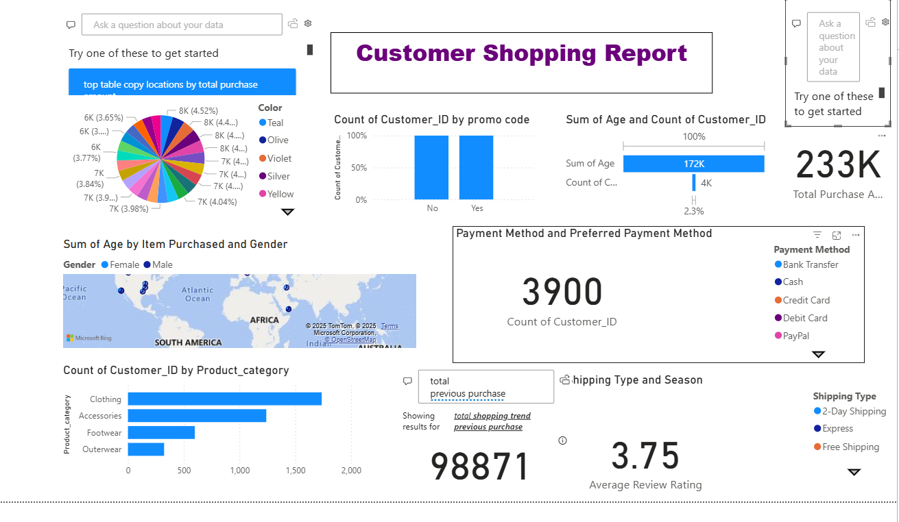

# 🚚 Customer Shipping Data Analysis – Power BI Dashboard

This Power BI project presents a detailed analysis of **customer shipping data** to extract insights related to delivery performance, customer behavior, and geographic distribution. It helps businesses improve shipping efficiency and customer satisfaction through interactive dashboards.

## 🔍 Key Features

- 📦 **Shipping Mode and Status Analysis**
- 🕒 **Delivery Time and Delay Trends**
- 🌍 **Geographic Distribution of Orders**
- 👤 **Customer Segmentation**
- 💰 **Order Volume & Value Tracking**

## 📁 Dataset Includes

- Order ID
- Customer ID
- Shipping Mode
- Order Date & Delivery Date
- Region
- Delivery Status
- Product Category
- Order Value

## 🛠 Tools Used

- Power BI Desktop
- Power Query (for data cleaning and transformation)
- DAX (for KPIs and calculated metrics)

## 📊 Outcome

This dashboard enables businesses to:
- Identify late shipments
- Compare regional performance
- Understand customer behavior
- Optimize shipping methods
